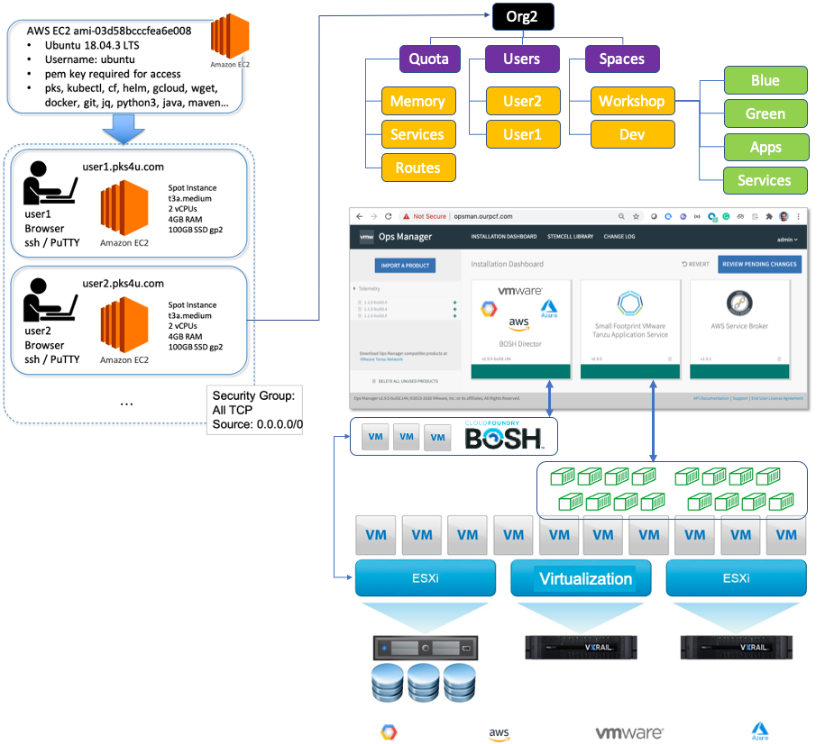
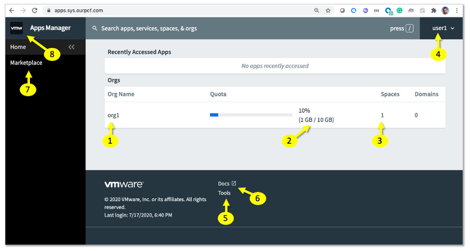
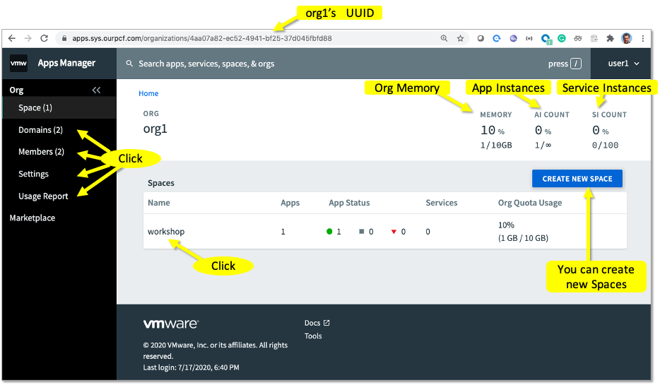
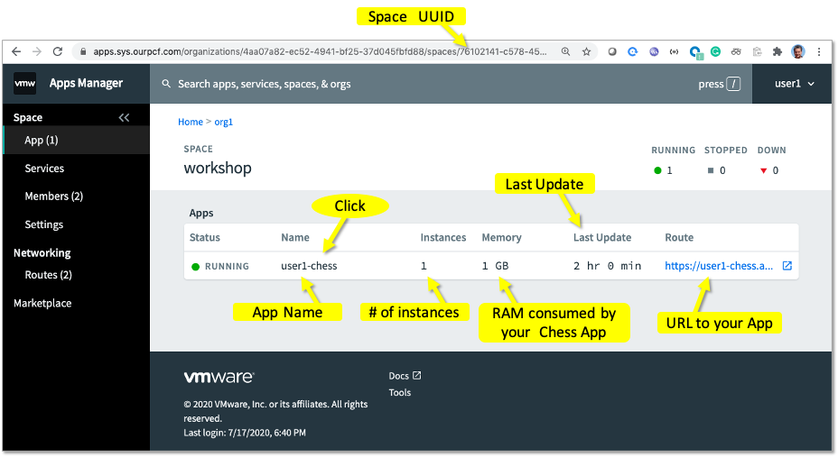
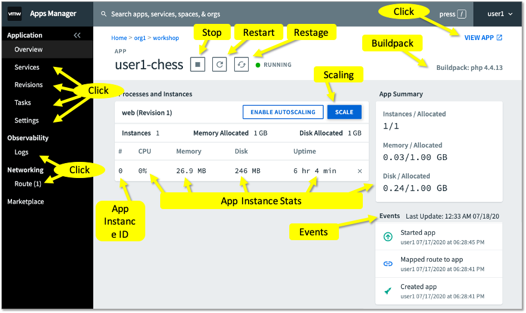
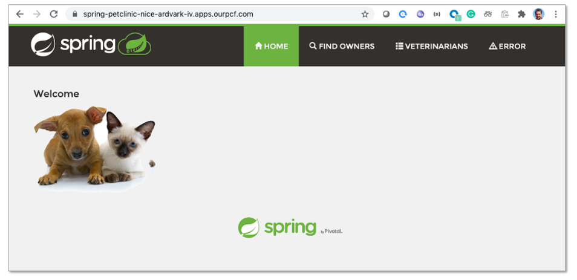
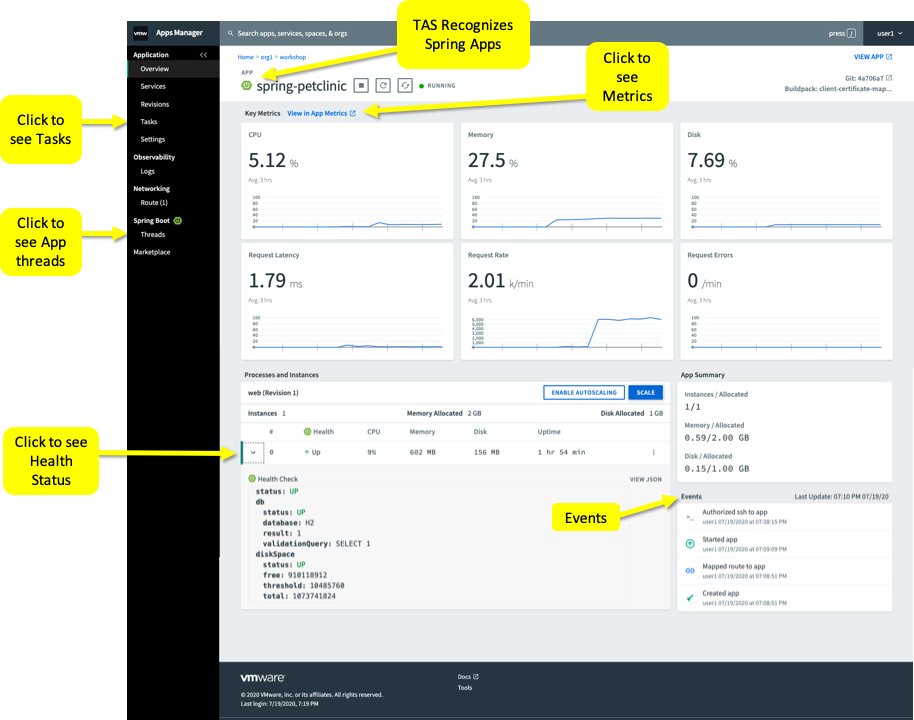

# VMware Tanzu Application Service Workshop 
### (8:30AM to 12:30PM on 07-22-2020)

- If you haven't yet, please go to the [prerequisites](https://github.com/rm511130/TAS-Workshop-Prerequisites#vmware-tanzu-application-service-workshop) page and execute the required steps for today's workshop.

#
## Introduction to Tanzu Application Service (TAS)

- [Tanzu Application Service](https://tanzu.vmware.com/application-service) is a PaaS (Platform as a Service) based on [Open Source Cloud Foundry](https://docs.cloudfoundry.org/concepts/overview.html).

- At a glance:
   - [Developers love TAS](https://www.youtube.com/watch?v=xdw_9dADM-4) because it frees and empowers them to do what they love most: to code.
   - TAS is a Cloud Native Polyglot platform supporting Java, Spring, .NET, NodeJs, ...
   - TAS is an HA platform that runs on Any Cloud delivering the same developer experience on AWS, Azure, GCP and vSphere.
   - TAS helps companies deliver better software, faster and more frequently.
   - TAS Operators can patch and upgrade the platform without downtime.
   - TAS = Speed + Stability + Scalability + Security + Savings

- Action item: reserve time on your calendar for the Sept 2 & 3, SpringOne 2020 event. It will be free and 100% on-line. [Read more](https://github.com/rm511130/SpringOne-2020/blob/master/README.md)

-----------------------------------------------------
## Guidelines & Conventions for this Workshop 

- This self-paced workshop includes presentations, videos, demos and most of all, hands-on labs. 
- The labs are interdependent and must be executed in order.
- The lab environments will only be available during the ~5hrs (a limited window of time) dedicated for the joint start and self-paced completion of the workshop.
- Please use the [Workshop Google Sheet](https://docs.google.com/spreadsheets/d/1pV7kOcfzq_bHbXP0pa79NtPMpY3zVHSAZ8HpHaHyrKI/edit?usp=sharing) to claim a userID for this workshop. For example, Ralph Meira is user1.
- Update the same [Workshop Google Sheet](https://docs.google.com/spreadsheets/d/1pV7kOcfzq_bHbXP0pa79NtPMpY3zVHSAZ8HpHaHyrKI/edit?usp=sharing)  as you progress through the Labs, by placing an "X" in the appropriate column.
- Each workshop participant will be assigned a Ubuntu VM previously set up for the execution of hands-on Labs. Your Laptop or Desktop will only be used for two purposes: 
     - SSH'ing or PuTTY'ing into the Ubuntu VM 
     - Browsing web pages
- When carrying out hands-on labs, you will be asked to cut-&-paste the commands shown `in boxes like this one` from this github page to your Ubuntu VM Terminal Window. However, when issuing commands, please make sure to alter the userID to match the one you have claimed, e.g.:
  - `ssh -i fuse.pem ubuntu@user3.pks4u.com` is for `user3` 
  - `ssh -i fuse.pem ubuntu@user15.pks4u.com` is for `user15` 
- In order to simplify the cut-&-paste-&-replace steps described above, once you are operating on your Ubuntu VM Terminal, we will define environment variables that will hold your specific login name as claimed in the [Workshop Google Sheet](https://docs.google.com/spreadsheets/d/1pV7kOcfzq_bHbXP0pa79NtPMpY3zVHSAZ8HpHaHyrKI/edit?usp=sharing). In this way, the cut-&-paste steps will not require you to edit the command line before pressing `return`.
- As you work through the labs, please make every effort to not just cut-&-paste-&-execute the labs without actually asking yourself a few questions:
   - Why am I being asked to cut-&-paste-&-execute these commands?
   - What do I think these commands will do (before actually running them)?
   - What is the role of the person who will be executing these commands in the future?

- Throughout this document, when it's time for hands-on labs, you will see the following icon:
     


-----------------------------------------------------
## TAS Workshop Architecture, Installation & Set-up 

- Architecture Diagram of Workshop Environment:




-----------------------------------------------------

## LAB-1: SSH into your Linux Workshop VM environment & Test the Command Line Interface tools

- Let's start by logging into the Workshop environment from your machine (Mac, PC, Laptop, Desktop, Terminal, VDI). You will need to use the following private key: 
   - [fuse.pem](./fuse.pem) if using a Mac.
   - [fuse.ppk](./fuse.ppk) if using a Windows PC.

- Note that the examples shown below apply to `user1`. If, for example, you are `user11`, your Ubuntu VM will be at `user11.pks4u.com`.


- In the pre-requisites section of this workshop, you were asked to use `ssh` or `PuTTY` to access the Ubuntu VM that has been assigned to your [UserID](https://docs.google.com/spreadsheets/d/1pV7kOcfzq_bHbXP0pa79NtPMpY3zVHSAZ8HpHaHyrKI/edit?usp=sharing). Please go ahead and create a Terminal Session into your VM. The example shown below applies to `user1` if he or she had downloaded the `fuse.pem` key to a Mac. If you need, the `PuTTY` instructions for Windows PC users can be found [here](./PuTTY_and_SSH.md).

```
ssh -i ~/Downloads/fuse.pem ubuntu@user1.pks4u.com 
```

- Once logged in, you can ignore any messages that ask you to perform a `do-release-upgrade`. 

- Please check whether the greeting information matches your UserID. For example, `user22` should see something like this:

```
my_number is 22
openjdk version "11.0.7" 2020-04-14
OpenJDK Runtime Environment (build 11.0.7+10-post-Ubuntu-2ubuntu218.04)
OpenJDK 64-Bit Server VM (build 11.0.7+10-post-Ubuntu-2ubuntu218.04, mixed mode, sharing)
Your UserID is user22
Your DevopsID is devops22
Your Namespace in the Shared-Cluster is namespace22
Your role in the Shared-Cluster is vmware-role22
```

- If you believe your greeting information to be wrong, please alert the workshop organizers. 

- If all is well, please proceed by executing the following commands. These commands will validate that your VM has all the necessary CLIs and frameworks for this workshop.

```
cf --version
git version
java -version
mvn -version
gfsh version
dotnet --version
```

- If any of the commands shown above did not work or produced and error, please alert the workshop organizers.

- Please proceed by executing the following commands. They are all you need to deploy your first App to the Cloud.

```
cd ~
git clone https://github.com/rm511130/chess
cd ~/chess; rm README.md; ls
cf login -a api.sys.ourpcf.com -u $user -p password
cf push $user-chess
```

- Once the `cf push` operation ends, you should see the a message similar to the one shown below:

```
name:              user1-chess
requested state:   started
routes:            user1-chess.apps.ourpcf.com              <------ Use this URL to access your App
last uploaded:     Fri 17 Jul 15:58:21 EDT 2020
stack:             cflinuxfs3
buildpacks:        php_buildpack

type:            web
instances:       1/1
memory usage:    512M
start command:   $HOME/.bp/bin/start
     state     since                  cpu    memory          disk           details
#0   running   2020-07-17T19:58:39Z   0.7%   27.2M of 512M   246.4M of 1G
```

- Open a browser window to access your URL. In the example above, the URL is `https://user1-chess.apps.ourpcf.com`. Your URL will begin with your UserID.

- Execute a simple `ls` command to see the file that was `git cloned` to your Workshop VM.

**Let's recap:** 
- You ssh'ed into your Workshop VM and verified the versions of certain installed CLIs (Command Line Interface) such as the cf CLI.
- You used `cf login` to point to a TAS plaform and login. You then used `cf push` to  push your first App to TAS: a game of chess.
- Please note that:
  - Your Chess App has a FQDN (fully qualified domain name)
  - Your App is secured by a valid Certificate which enables HTTPS communication
  - Your App was containerized using curated packages and deployed on the cloud in an HA environment
  - As a developer, you did not need to worry about container filesystems and dependencies.
  - Your App code, `index.php`, had no dependencies linked to the PaaS or IaaS you are using. You are completely cloud agnostic.
  - Your App is running on a platform that is 100% up to date with the latest known [CVE](https://cve.mitre.org/) patches
  - You did not have to open any tickets with Infrastructure, Operations, Networking, Security, ... to deploy your App.
  - And yet, access to your Chess App is going through routers, load balancers, firewalls and benefiting from valid certificates. 
  - Your Chess App has also been wired-in for logging (with log consolidation) and APM (Application Performance Monitoring).
  - No wonder developers love TAS.

- Congratulations, you have completed LAB-1.

Please update the [Workshop Google Sheet](https://docs.google.com/spreadsheets/d/1pV7kOcfzq_bHbXP0pa79NtPMpY3zVHSAZ8HpHaHyrKI/edit?usp=sharing) with an "X" in the appropriate column.


-----------------------------------------------------

## LAB-2: Apps Manager & CF CLI


- The web-based [Apps Manager](https://docs.pivotal.io/platform/application-service/2-9/console/) application helps you manage users, organizations, spaces, and applications.
- Let's log into Apps Manager and take a look around. Please open a browser at [https://apps.sys.ourpcf.com](https://apps.sys.ourpcf.com) and log-in using your UserID and `password`. Make sure to use your UserID, the one you claimed in the [Workshop Google Sheet](https://docs.google.com/spreadsheets/d/1pV7kOcfzq_bHbXP0pa79NtPMpY3zVHSAZ8HpHaHyrKI/edit?usp=sharing), and not `user1`.


- Once you are logged-in, you should see a `Home` page similar to the one shown below. Don't click on anything just yet.

- Please let the meeting organizers know that you are ready for the **Apps Manager Demo**

- Everyone will be asked to pause their activities for a short demo of Apps Manager.

#### Apps Manager Home-Page View



- Follow the numbers on the picture above. We will let you know when to click on them.

1. Your `org` is a logical segmentation of your PaaS environment that allows `Org Managers` to control settings and resources, such as `spaces`, `domains`, and `members` associated with the selected `space`, in Apps Manager. Corporations tipically use `Org` structures to align/organize TAS around Business Units, Company Divisions, Products, or Program Areas.

2. `Orgs` can have one or many `Spaces`. `Spaces` are often named after Life-Cycle-Mgmt phases such as Prod, Dev, QA, Test, SandBox. It's within `Spaces` that Apps are executed. `Memory` is a resource managed at the `Org` level. In the diagram shown above, next to the #2 yellow pointer, your `Org` is using a certain percentage of the 10GB allocated to it by the Platform Team of administrators.

3. Your `Org` has only one `Space` at the present time. When `user9` first logged into TAS using `cf login` on the terminal session, he/she landed at the `workshop` space witin `org9`. That's were we will find the `chess` App.

4. Yellow pointer #4 shows who is logged-in the Apps Manager session.

5. `Tools` is an easy way to get the `cf` CLI to get started.

6. `Docs` take you to [https://docs.pivotal.io/platform/application-service/2-9/overview/intro.html](https://docs.pivotal.io/platform/application-service/2-9/overview/intro.html)

7. `Marketplace` is where you will find services such as  databases, key-value stores, message queuing solutions, and much more.

8. `Home` and the  `Apps Manager`  on the top left of your browser, take you back to the `home page`.

#### Apps Manager Org-Level View



#### Apps Manager Space-Level View



#### Apps Manager App-Level View




### CF CLI

- Let's get back to your `ssh` session on your Workshop Linux VM. Let's execute a few commands using the `cf` CLI. 

- When looking at Apps Manager, you probably noticed that your Chess App was allocated, by default, 1GB of RAM. You also saw that only one instance of Chess was up and running. Let's change that by executing the following command to decrease the memory down to 100MB and increase the App Instances to 3:

```
cf scale $user-chess -m 100M -i 3
```

- Note: the command above will require the restart of your `Chess` App because we are literally reconfiguring the containers that are running your App. Later on, during Lab-4, we will see a technique for making such a change without any Application downtime.

- You can view the changes implemented by the command you just executed in [Apps Manager](https://apps.sys.ourpcf.com), or you can also use the `cf` CLI as follows:

```
cf events $user-chess
```

- Let's create another `Space` under your `Org`, and allow one of your colleagues to access this new `Space`. Execute the following command to create a `dev` space under your Org:

```
cf create-space dev -o org$my_number
```

- With the next command, you will be giving every `user` in this workshop access to the `dev` space you just created. 

```
for i in {1..22}; do cf set-space-role user$i org$my_number dev SpaceDeveloper; done
```

- You can now ask any of your colleagues to access the `dev space` in your `org`. The same will apply to you, so use the following command to see what `orgs` are available for you to target, and then target a new `org` that is not yours to access its `dev space`. The `cf target` command below will try to target the `org` and `dev space` of your preceding colleague: e.g. if you are `user5`, he `cf target` command below will attempt to target `org4` and its `dev space`. The `cf target` command may fail if your colleague hasn't yet given you access to his/her `org` and `dev space`, so you can always comme back later to see the next two commands working, or you can adjust the `-o orgID` to one that is available to you.

```
cf orgs
cf target -o org$((my_number-1)) -s dev           
```

- Let's execute a few more `cf` CLI commands. Looking at the next few commands, it should be easy to undestand what they do. The point of this exercise is just to give you an idea of what you can do with the `cf` CLI. If you have any questions, please ask them to the meeting organizers.

```
cd ~/chess
cf target -o org$my_number -s workshop
cf spaces
cf org-users org$my_number
cf apps
cf app $user-chess
cf marketplace
cf create-app-manifest $user-chess
cat $user-chess_manifest.yml
cf logs $user-chess --recent
cf quotas
```

- Let's now log into one of the containers that is running your `chess` App using the following command:

```
cf ssh $user-chess
```

- You should see a Linux prompt that looks something like this: `vcap@fd9dcac5-3ca3-4c5c-50dc-0024:~$`. Please proceed by executing the following commands:

```
ps -ef
whoami
cat /etc/*release | head -n 4
df -h
```

- The next command you will execute is distructive in nature. We will be `killing` a critical process in the container you are logged in to see what `TAS` is going to do. Please execute the following command:

```
kill -9 $(ps -ef | grep diego-sshd | head -n 1 | awk '{ print $2 }')
```

- Now take a look at how your `chess` App is doing using the following command:

```
cf events $user-chess
cf app $user-chess
```

- As you may have noticed, the container that you killed was immediately substituted by a new one. TAS is constantly looking at the health of your Apps, as well as the health of the overall environment, to effectively maintain your App Instances running in the most efficient and HA manner possible. This means that TAS is multi-AZ (availability zones) aware and able to distribute your App Instances intelligently across different clusters or data-centers, in order to guarantee maximum availability.

**Let's recap:** 
   - You now know how to access your Apps Manager GUI.
   - You should also be comfortable with the concept of Orgs and Spaces, and the use of the `cf` CLI.
   - You created a new `space` within your `org`, and granted access so that your colleagues could use it.
   - You experimented with `cf logs` and `cf events`
   - You saw how `TAS` quickly recovered your App after it was forced to crash.

- Congratulations, you have completed LAB-2.

Please update the [Workshop Google Sheet](https://docs.google.com/spreadsheets/d/1pV7kOcfzq_bHbXP0pa79NtPMpY3zVHSAZ8HpHaHyrKI/edit?usp=sharing) with an "X" in the appropriate column.
 

-----------------------------------------------------

## LAB-3: Running a Spring-Boot App on TAS

    

- Execute the following commands:

```
cd ~ 
git clone https://github.com/rm511130/spring-petclinic.git
cd spring-petclinic
```
```
./mvnw -Dmaven.test.skip=true package
```
```
./mvnw spring-boot:run
```

- Once you see in your logs that `Tomcat started on port(s): 8080` you can proceed to test your `Pet Clinic` program. This is the **local** way of running your Apps.

- To test, open a browser to access the following URL. Remember to use the proper FQDN that corresponds to your UserID: e.g. `user11` should use `http://user11.pks4u.com:8080`.

```
http://user1.pks4u.com:8080
```
- If the `Pet Clinic` App is running you have a good Spring/Java example to work with.

- You can use `CRTL-C` on your Ubuntu VM to cancel out of the `spring-boot Pet Clinic` program.

- Now let's `cf push` the same App to `TAS`. Please execute the following commands:

```
cat manifest.yml
cf push
```

- Once the `cf  push` has finished executing, you should be able to access your `Petclinic` App using the URL shown in the output logs. In the example shown below, the URL for the `Petclinic` App can be seen on the 3rd line, next to the word `routes:`. It's `https://spring-petclinic-nice-ardvark-iv.apps.ourpcf.com`, a uniquely generated URL, because the `manifest.yml` file contained the following line: `random-route: true`. 

```
name:              spring-petclinic
requested state:   started
routes:            spring-petclinic-nice-ardvark-iv.apps.ourpcf.com
last uploaded:     Sun 19 Jul 23:04:53 UTC 2020
stack:             cflinuxfs3
buildpacks:        client-certificate-mapper=1.11.0_RELEASE container-security-provider=1.16.0_RELEASE
                   java-buildpack=v4.29.1-offline-https://github.com/cloudfoundry/java-buildpack.git#864477c java-main java-opts
                   java-security jvmkill-agent=1.16.0_RELEASE open-j...

type:            web
instances:       1/1
memory usage:    2048M
start command:   JAVA_OPTS="-agentpath:$PWD/.java-buildpack/open_jdk_jre/bin/jvmkill-1.16.0_RELEASE=printHeapHistogram=1
                 -Djava.io.tmpdir=$TMPDIR -XX:ActiveProcessorCount=$(nproc)
                 -Djava.ext.dirs=$PWD/.java-buildpack/container_security_provider:$PWD/.java-buildpack/open_jdk_jre/lib/ext
                 -Djava.security.properties=$PWD/.java-buildpack/java_security/java.security $JAVA_OPTS" &&
                 CALCULATED_MEMORY=$($PWD/.java-buildpack/open_jdk_jre/bin/java-buildpack-memory-calculator-3.13.0_RELEASE
                 -totMemory=$MEMORY_LIMIT -loadedClasses=18868 -poolType=metaspace -stackThreads=250 -vmOptions="$JAVA_OPTS") && echo JVM
                 Memory Configuration: $CALCULATED_MEMORY && JAVA_OPTS="$JAVA_OPTS $CALCULATED_MEMORY" && MALLOC_ARENA_MAX=2
                 SERVER_PORT=$PORT eval exec $PWD/.java-buildpack/open_jdk_jre/bin/java $JAVA_OPTS -cp $PWD/.
                 org.springframework.boot.loader.JarLauncher
     state     since                  cpu    memory         disk         details
#0   running   2020-07-19T23:05:15Z   0.0%   355.2M of 2G   156M of 1G
```



- Now execute the following commands to run a `cf run-task`:

```
export my_route=$(cf app spring-petclinic | grep route | awk '{ print $2 }')
export my_task="cf run-task spring-petclinic \"while (true); do curl -k http://"$my_route"; done\" --name $user-task"
echo $my_task | set --
"$@"
echo $my_task
```

- The `Linux Shell` commnands shown above assemble a simple one-line command to execute a `cf run-task`. The `task` performs `curl` commands against the URL of your `Petclinic` App. The actual one-line command is contained in the `$my_task` variable which was `echo'ed` out for you to see.

-  Now let's take a look at [Apps Manager](https://apps.sys.ourpcf.com/). Please click on the various links shown in the following image. To get to your `Petclinic` App, you will need to navigate [`Apps Manager`](https://apps.sys.ourpcf.com/), going from your `Org`, to your `Workshop Space`, and to your `App`.



**Let's recap:** 
   - You used Maven to create a `jar` file which youu executed locally on your Ubuntu Workshop VM.
   - You then used `cf push` to push your `Petclinic` App to `TAS`, and you used a browser to validate that it was working as expected.
   - You now have two Apps running on TAS: `Chess` & `Petclinic`. 
   - Your `Petclinic` App is being warmed-up by a never-ending `while (true)` loop which was executed as a `cf run-task`. We will come back to this area in a subsequent lab, when we will address App auto-scaling.
   - You used Apps Manager to see how your `Petclinic` App is performing. App Manager showed you metrics, App tracing details, and health-check details.

- Congratulations, you have completed LAB-3.

Please update the [Workshop Google Sheet](https://docs.google.com/spreadsheets/d/1pV7kOcfzq_bHbXP0pa79NtPMpY3zVHSAZ8HpHaHyrKI/edit?usp=sharing) with an "X" in the appropriate column.


-----------------------------------------------------

## LAB-4: Blue-Green, Zero-Downtime-Deploymemt

    

- Your `Chess` App can have different colors: e.g. blue & green.
 
- Please keep your browser open on your `Chess` App at `http://userID-chess.apps.ourpcf.com`. You will be asked to hit the refresh button multiple times to see the seamless transition between Blue-Chess to Green-Chess.

- Let's get started by making some changes to your `Chess` App. Please execute the following commands to change your `Chess` from blue to green:

```
cd ~/chess
sed -i 's/c0c/1ffe/g' index.php
sed -i 's/blue/green/g' index.php
```

- As soon as you have executed the command shown below, start to hit the refresh button on the browser to see your `Chess` App change from blue to green. The `watch` command shown below will also show you what is happening to your App:

```
cf v3-zdt-push $user-chess -b php_buildpack
watch cf app $user-chess
```

- Once the change has happened, you can use `CTRL-C` to exit the `watch` loop.

- Let's take a look at `Revisions` in your Apps Manager. Please navigate to the `Revisions` tab of your `Chess` App in the Apps Manager GUI.

- You can also define environment variables on-the-fly without needing to restage or restart your App. Please execute the following commands:

```
cf env $user-chess
cf v3-set-env $user-chess color green
cf env $user-chess
```

- You can see, from how the commands above behave, that if your App looks at environment variables to determine its behavior, the `cf v3-set-env` command is indeed a very powerful tool. 

- During Lab-2 we re-sized the `Chess` containers down from 1GB to 100MB RAM. This operation led to App Downtime because the App was restaged. Back then, we mentioned that there was a way of circumventing the need for downtime. Please execute the following commands to see how to resize your containers without any downtime. As soon as you start to execute the commands shown below, you can start to hit the refresh button on the browser to validate that your `Chess` App will not go down during the vertical resizing of the containers.

```
cd ~/chess
cf push $user-chess-v2 -m 99M -i 3 -b php_buildpack
cf map-route $user-chess-v2 apps.ourpcf.com --hostname $user-chess
cf stop $user-chess
```

- You still have access to your first version of the `Chess` App with it's 100MB of RAM, but the App now serving the request on the same URL is the v2 which is now sized to consume 99MB of RAM.

```
cf apps
cf unmap-route $user-chess-v2 apps.ourpcf.com --hostname $user-chess-v2
cf apps
```
- We can complete the switch by deleting the old version of the `Chess` App. Please execute the following commands:

```
cf delete $user-chess
cf apps
```

- The `cf map-route` command enables the dark launching of new features and their eventual introduction into the mainstream application. You can also have many routes mapped to the same App. For example, please execute the following commands:

```
cf map-route spring-petclinic apps.ourpcf.com --hostname $user-pets
cf apps
```

- Your `Petclinic` App now has an easier URL to remember, and it did not lose the previous URL.

**Let's recap:** 
- You performed zero-downtime deployment of a green-Chess App without any downtime.
- You introduced an environment variable to your environment without any downtime.
- You used `cf map-route` to introduce a new version of your App without any downtime and to simplify your `Petclinic` App URL.

- Congratulations, you have completed LAB-4.

Please update the [Workshop Google Sheet](https://docs.google.com/spreadsheets/d/1pV7kOcfzq_bHbXP0pa79NtPMpY3zVHSAZ8HpHaHyrKI/edit?usp=sharing) with an "X" in the appropriate column.


-----------------------------------------------------

## LAB-5: Application Autoscaling

    

- Let use a tiny program written in "C" to create some additional load on your "Petclinic" App. Please execute the following commands:

```
cd ~
git clone https://github.com/rm511130/curly
cd curly
export replace_me="chess.cfapps.io"
export replace_by=$user-pets.apps.ourpcf.com
sed -i "s|$replace_me|$replace_by|g" cf_push_example_binary_buildpack.sh 
chmod +x cf_push_example_binary_buildpack.sh 
./cf_push_example_binary_buildpack.sh 
```

- Once the commands above have completed, go to your Apps Manager to see how `Petclinic` is performing.

- For the purposes of this Lab, we wish to keep the average %CPU between 15% and 25%. 

1. Using your Apps Manager, navigate to your `Petclinic` overview page and please click on **Enable Autoscaling**

2. Click on **Manage Auutoscaling**

3. An autoscaling tab will pop from the right side of your browser. Click on _Scaling Rules_ **Edit**  

4. Click on **Add Rule**

5. The Rule Type should be **CPU Utilization**

6. In the box for _scale down if less than_ type in **15** 

7. In the box for _scale up if more than_ type in **25** and click on **Save**

8. On the _INSTANCE LIMITS_ section, set _Minimum_ to **1** and set _Maximum_ to **10** and then hit apply changes.

9. You can now **close** the _AutoScaling Tab_ by clicking on the *x* at the top left hand corner of the tab.

10. Now observe the system at work.

- Can this type of scaling be done via scripts and configuration files? Yes, absolutely. The first step is to extende the `cf` CLI features by using plug-ins. Let's add the _Cloud Foundry CLI AutoScaler Plug-in_ to your Workshop VM. Please execute the following commands:

```
cf install-plugin -r CF-Community app-autoscaler-plugin
cf plugins
```

- From here on, you can read about the `cf autoscaler` commands [here](https://github.com/cloudfoundry/app-autoscaler-cli-plugin). For the purposes of this Lab, we will stop here and perform some clean-up. Please execute the following command:

```
cf delete curly
cf tasks spring-petclinic
cf terminate-task spring-petclinic $(cf tasks spring-petclinic | head -n 5 | tail -n 1 | awk '{print $1}')
```

**Let's recap:** 
- Autoscaling seamlessly scales our App horizontally by increasing or decreasing the number of App Instances to meet your desired throughput, latency, %CPU, ... goals.

- Congratulations, you have completed LAB-5.

Please update the [Workshop Google Sheet](https://docs.google.com/spreadsheets/d/1pV7kOcfzq_bHbXP0pa79NtPMpY3zVHSAZ8HpHaHyrKI/edit?usp=sharing) with an "X" in the appropriate column.


